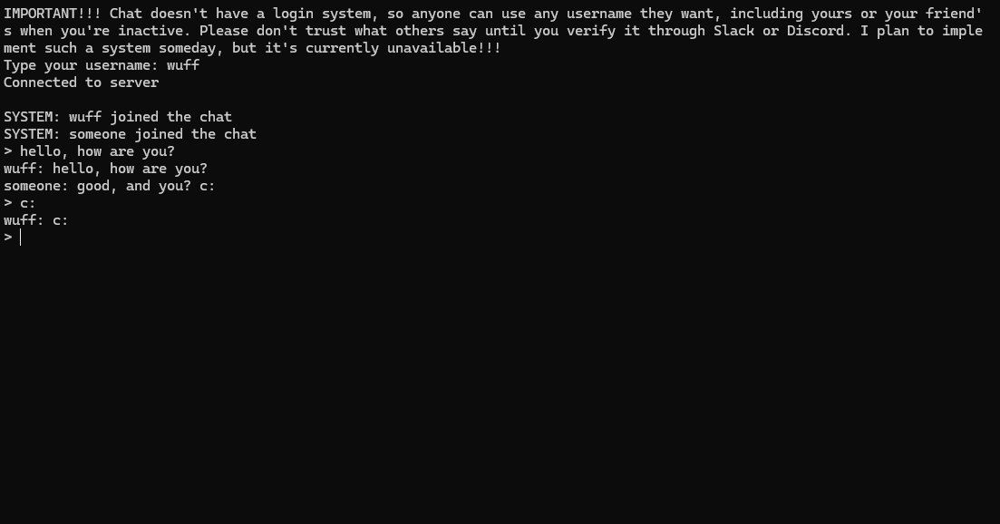

# Global-Chat

Global chat available to everyone. Chat with anyone on Earth and exchange messages using Terminal/CMD now!



## Features

- **Global Connectivity** – Connect and chat with anyone on Earth directly through your terminal
- **Asynchronous CLI** – Built with `prompt_toolkit`, meaning incoming messages won't interrupt what you are currently typing
- **Anti-Spam Protection** – Built-in message cooldowns to keep the chat clean and readable
- **Robust Moderation** – Complete server-side control with built-in commands to ban users by IP, kick, or view the online list
- **Chat History** – New users automatically receive the last 10 messages upon joining so they never lose context

## **Installation Guide CLIENT**

---

### Requirements:

- windows or linux
- internet or wifi

### Windows

1. Download `client.exe` from Releases tab
2. Open and type username

GG now you can write with someone!!!

### Linux (coming soon)

## **Installation Guide SERVER**

---

## SERVER

### Requirements:

- `python` (I use version 3.13)
- `docker compose` (if you want to follow this guide)

### **Linux (with docker)**

1. In the terminal, go to the directory where you want to copy the repository and run this command:

   ```
   git clone https://github.com/wuffgame/Global-Chat
   ```
2. Next, go to the folder `global-chat` with the `Dockerfile` and run this command for the server:

   ```
   docker compose up --build -d
   ```
3. Ready, enjoy using it!!!

GG your server is ready!!

## CLIENT

---

### Requirements:

- `python` (I use version 3.13)
- `prompt_toolkit`

### Windows

1. Go to `global-chat/client.py`, in line 10:
   ```client.connect(("127.0.0.1", 12345))``` change ip and port to the same as the server
2. In cmd in the same folder install `pyinstaller` using ```pip install pyinstaller```
3. Then type ```pyinstaller --onefile client.py``` and your `client.exe` will be in folder `/dist`

GG You have your private global chat!!!

## Server Commands

Run these command directly in the server console to moderate the chat:

- `kick <username>` - Kick a user from the chat
- `ban <username>` - Ban user's IP
- `unban <ip>` - Unban an IP
- `ban-list` - Show all banned IPs
- `list` - See who is online
- `say <message>` - Send an official system announcement
- `help` - See all server commands

## Other

### AI usage

AI is used as a learning tool to help understand certain parts of code, but I still write the main code myself.

### Credits

Thanks Hack Club for give me motivation to end this project!!!

### **Notes**

MacOs install guide will come someday when I get access to one.
